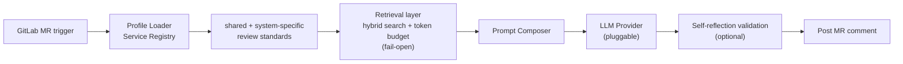

## Problem
As the team grew, code review throughput became a bottleneck. Senior engineers spent their best hours on the predictable parts (naming, test coverage, config drift) instead of architecture.

## Architecture

## Retrieval layer (2026)
The prompt used to carry everything the reviewer might need. That stops scaling once the standards, the API contracts and the accumulated review history all want a seat. In 2026 the context assembly was replaced with retrieval: a self-built embedded vector store — SQLite for storage, 768-dimension embeddings, brute-force L2 in plain JS, because at this corpus size an external vector database would be weight without benefit.

Retrieval is hybrid: BM25 and embedding search fused with RRF, routed in two structured tiers, with a per-source token budget so no single corpus can crowd the others out of the prompt. The index is built offline on a weekly job and published atomically with a sha256 checksum the consumer verifies before switching over. Every stage fails open — hybrid degrades to lexical, lexical degrades to loading everything — so a broken index slows a review down but never blocks a merge.

What the benchmark supports, and what it does not: measured on recall, hybrid retrieval beats lexical-only on all three corpora. Ranking quality is a weaker story — by MRR only the contract corpus improved clearly, while the other two trade places with lexical search. So the defensible claim is that the right context gets found, not yet that it gets ranked better. This layer has been live for weeks, not quarters; treat it as an early result.

## My Role
From v1.0 design through v2.0 expansion: profile module, the self-reflection pass, and the cross-microservice rollout.

## Impact
- v1.0 → v2.0: expanded from the initial rollout to frontend and backend microservices across main pipelines
- Two internal survey rounds showed most engineers change code on its suggestions before merging, with reliance growing each iteration
- Two rounds of independent adversarial code review before rollout surfaced 24 findings including 4 blockers; all were fixed with paired mutation tests, and the CI gate went from decorative to load-bearing (230+ tests that actually block a merge)
- Trust boundary: the rule mapping is pinned to the default branch, so an MR author cannot influence the rules applied to their own review. The first live run caught a forged bot-marker comment — the threat model was not hypothetical

## Lessons — An 11-year architecture lineage
2015 at iPanSec — A4P: Python subprocess running MobSF, web crawler scraping the report → structured output.
2024 at Cedars — AI Code Review: replace MobSF with an LLM API; the rest of the skeleton barely changed.
2026 — add the retrieval layer: the skeleton *still* barely changed. What changed is that the model is handed a selection instead of everything.

A senior engineer's long-term value isn't the new framework they can name. It's recognizing which old problem just got a better solution.
