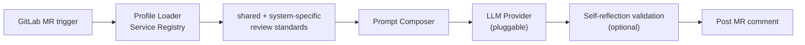

## Problem
As the team grew, code review throughput became a bottleneck. Senior engineers spent their best hours on the predictable parts (naming, test coverage, config drift) instead of architecture.

## Architecture

## My Role
From v1.0 design through v2.0 expansion: profile module, the self-reflection pass, and the cross-microservice rollout.

## Impact
- v1.0 → v2.0: expanded from the initial rollout to frontend and backend microservices across main pipelines
- Two internal survey rounds showed most engineers change code on its suggestions before merging, with reliance growing each iteration

## Lessons — A 9-year architecture lineage
2015 at iPanSec — A4P: Python subprocess running MobSF, web crawler scraping the report → structured output.
2024 at Cedars — AI Code Review: replace MobSF with an LLM API; the rest of the skeleton barely changed.

A senior engineer's long-term value isn't the new framework they can name. It's recognizing which old problem just got a better solution.
