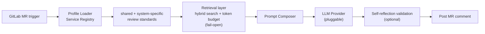

## Problem
Review throughput stopped keeping up with the code the engineers were producing. What bothered me wasn't the queue length, it was where senior attention went: naming, missing tests, config that had drifted since the last release. The architecture questions, the ones only they could answer, waited behind all of that.

## Architecture

A service joins by registering a profile. Nothing lands in the service repo, so onboarding costs a team zero code changes and the review standards stay in one place instead of being copy-pasted into every pipeline.

## Retrieval, not a bigger prompt (2026)
The first version handed the reviewer everything it might need. That works until the review standards, the API contracts and a year of accumulated review history all want room in the same context window, and then it just stops. So in 2026 I replaced context assembly with retrieval, and built the vector store rather than adopting one: SQLite for storage, 768-dimension embeddings, brute-force L2 in plain JS. At this corpus size an external vector database is operational weight I'd be carrying for nothing.

Retrieval is hybrid. BM25 and embedding search get fused with RRF and routed in two structured tiers, and each source has its own token budget so one corpus can't crowd the others out of the prompt. A weekly offline job builds the index and publishes it atomically with a sha256 checksum that the consumer verifies before switching over. Every stage fails open: hybrid degrades to lexical, lexical degrades to loading everything. A broken index makes a review slower. It never blocks a merge.

Where the benchmark actually lands: on recall, hybrid beats lexical-only on all three corpora. Ranking is a weaker story. By MRR only the contract corpus improved clearly, and the other two trade places with lexical search depending on the query. What I'll defend is that the right context gets found. Not yet that it gets ranked better. This layer has been live for weeks, not quarters, so read it as an early result.

## My role
Design of v1.0 through the v2.0 expansion, including the profile module, the self-reflection pass, and the rollout across microservices.

## Impact
- v1.0 → v2.0 took it from the initial rollout to frontend and backend microservices on main pipelines
- Two internal survey rounds: most engineers change their code on the suggestions before merging, and the reliance grew between iterations
- Before rollout I put it through two rounds of independent adversarial code review, which found 24 issues, 4 of them blockers. Each fix shipped with a paired mutation test, and the CI gate stopped being decorative: 230+ tests that will actually stop a merge
- The rule mapping is pinned to the default branch, so an MR author can't influence the rules applied to their own review. The first live run caught a forged bot-marker comment, which settled the question of whether that threat model was theoretical

## Lessons — the same skeleton, three times over
In 2015 at iPanSec I built A4P: a Python subprocess driving MobSF, a crawler scraping the report, structured output at the end.

In 2024 at Cedars, AI Code Review swapped MobSF for an LLM API. The rest of the skeleton barely moved.

In 2026 the retrieval layer went in and the skeleton *still* barely moved. The one real change is that the model now gets a selection instead of the whole pile.

A senior engineer's long-term value isn't the newest framework they can name. It's noticing which old problem just got a better solution.
