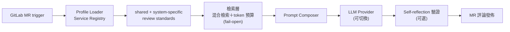

## 問題
Review 的產出速度跟不上工程師產原始碼的速度。真正讓我在意的不是隊伍排多長，而是資深工程師的注意力花在哪裡：命名、漏寫的測試、上次發版後就默默飄掉的設定。那些只有他們能回答的架構問題，全排在這些東西後面等。

## 架構

一個服務要接進來，只要註冊一份 profile；服務自己的 repo 裡不必放任何東西。所以團隊接入的成本是零行程式碼變更，審查標準也集中在一個地方，不會被複製貼上散進每一條 pipeline。

## 檢索，而不是更大的 prompt（2026）
第一版的做法是把審查可能用得到的東西整包餵給它。這招能撐一陣子，撐到審查標準、API 契約、累積一年的審查歷史都想在同一個 context window 裡佔位置——然後就不行了。所以 2026 年我把 context 組裝換成檢索，而且向量庫是自己寫的、沒有外掛現成的：SQLite 存放、768 維 embedding、純 JS 的 L2 暴力搜尋。在這個語料規模下，多養一套外部向量資料庫是白扛的維運成本。

檢索走混合路線。BM25 與 embedding 兩路結果用 RRF 融合，再經過兩層結構化路由，每個來源各有自己的 token 預算，所以任何單一語料都擠不掉其他語料在 prompt 裡的位置。索引由每週一次的離線工作建置，以原子方式發佈並附上 sha256 校驗碼，消費端驗過才切換。每一層都 fail-open：混合檢索壞了就退成詞彙檢索，詞彙檢索壞了就退成全量載入。索引壞掉只會讓一次審查變慢，永遠不會擋住合併。

benchmark 撐得起的說法到哪裡：以 recall 來看，混合檢索在三個語料上都贏純詞彙檢索。排序就沒那麼好看。以 MRR 衡量只有契約語料明顯進步，另外兩個語料跟詞彙檢索互有勝負，看查詢而定。我現在敢辯護的是「該找的找得到」，還不是「排得更好」。這一層上線的時間以週計、不是以季計，請當成早期結果看。

## 我的角色
從 v1.0 設計到 v2.0 擴張，包含 profile module、self-reflection 那一關，以及推廣到各個微服務。

## 成果
- v1.0 → v2.0：從初期部署擴展到 main pipeline 上的前後端微服務
- 兩輪內部問卷：多數工程師會照建議在合併前改 code，而且這份依賴在兩次迭代之間變重了
- 上線前我讓它跑過兩輪獨立的對抗式 code review，挖出 24 個問題、其中 4 個是 blocker。每個修正都配一支變異測試一起進去，CI 門檻也從裝飾品變成真的會擋合併：230+ 個測試
- 審查規則的對應關係固定綁在預設分支，MR 作者影響不了套用在自己審查上的規則。第一次正式運行就攔到一則偽造的 bot 標記留言——這個威脅模型是不是紙上談兵，當場就有答案了

## 學到什麼——同一副骨架，用了三次
2015 年在 iPanSec 做 A4P：一個 Python subprocess 驅動 MobSF、一支爬蟲抓報表，最後輸出結構化結果。

2024 年在 Cedars，AI Code Review 把 MobSF 換成 LLM API，其餘骨架幾乎沒動。

2026 年補上檢索層，骨架**還是**幾乎沒動。真正變的只有一件事：模型現在拿到的是選過的東西，不是整堆。

資深工程師的長期價值，不在於他能講出哪個最新的框架，而在於他看得出哪個老問題現在有更好的解法。
