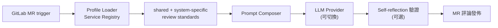

## Problem
團隊擴張後 code review 容量成為瓶頸。Senior 工程師每天花在重複型 review（命名、測試覆蓋、config 一致性）的時間排擠了架構討論。

## Architecture

## My Role
從 v1.0 開始設計到 v2.0 擴張：profile module、self-reflection 機制、跨 FE/BE microservices 整合。

## Impact
- v1.0 → v2.0：自初期部署擴展至多個前後端微服務的 main pipeline
- 兩輪內部問卷顯示多數工程師依建議在合併前改 code，對流程的依賴度隨迭代上升

## Lessons — 架構模式的 9 年復用
2015 年在 iPanSec 的 A4P：Python subprocess 跑 MobSF + 爬取報表 → 結構化輸出。
2024 年 AI Code Review：把 MobSF 換成 LLM API，其餘骨架幾乎不變。

工程師的長期價值，往往不在會用什麼新框架，而是知道哪個老問題現在有更好的解法。
