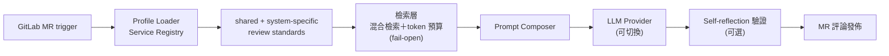

## Problem
團隊擴張後 code review 容量成為瓶頸。Senior 工程師每天花在重複型 review（命名、測試覆蓋、config 一致性）的時間排擠了架構討論。

## Architecture

## 檢索層（2026）
以前的做法是把審查可能用得到的東西整包塞進 prompt。當審查標準、API 契約、累積下來的歷史 findings 都想要一席之地時，這個做法就撐不住了。2026 年把 context 組裝換成檢索：自建的嵌入式向量庫——SQLite 存放、768 維 embedding、純 JS 的 L2 暴力搜尋，因為在這個語料規模下，外掛一套向量資料庫只會是負擔而不是助力。

檢索走混合路線：BM25 與 embedding 兩路結果用 RRF 融合，經過兩層結構化路由，並對每個來源做 token 預算，避免任何單一語料把其他語料擠出 prompt。索引由每週的離線工作建置，以原子性方式發佈並附 sha256 校驗碼，消費端驗證通過才切換。每一層都是 fail-open——混合檢索壞了降級成詞彙檢索，詞彙檢索壞了降級成全量載入——所以索引出問題只會讓審查變慢，不會擋住合併。

benchmark 撐得起什麼、撐不起什麼：以 recall 衡量，混合檢索在三個語料上都優於純詞彙檢索。排序品質就沒那麼漂亮——以 MRR 來看只有契約語料明顯改善，另外兩個語料仍與詞彙檢索互有勝負。所以現在可辯護的說法是「該找的找得到」，還不是「排得更好」。這一層上線的時間以週計、不是以季計，請當成早期結果來看。

## My Role
從 v1.0 開始設計到 v2.0 擴張：profile module、self-reflection 機制、跨 FE/BE microservices 整合。

## Impact
- v1.0 → v2.0：自初期部署擴展至多個前後端微服務的 main pipeline
- 兩輪內部問卷顯示多數工程師依建議在合併前改 code，對流程的依賴度隨迭代上升
- 上線前跑了兩輪獨立的對抗式 code review，挖出 24 個 findings、其中 4 個是 blocker，全數修掉並補上對應的變異測試；CI 門檻也從裝飾品變成真的會擋合併（230+ 個測試）
- 信任邊界：審查規則的對應關係固定綁在預設分支，MR 作者無法影響套用在自己身上的規則。首次正式運行就攔到一則偽造的 bot 標記留言——這個威脅模型不是假想的

## Lessons — 架構模式的 11 年復用
2015 年在 iPanSec 的 A4P：Python subprocess 跑 MobSF + 爬取報表 → 結構化輸出。
2024 年 AI Code Review：把 MobSF 換成 LLM API，其餘骨架幾乎不變。
2026 年再加上檢索層：骨架**還是**幾乎不變。變的是餵給模型的東西，從「全部」變成「選過的」。

工程師的長期價值，往往不在會用什麼新框架，而是知道哪個老問題現在有更好的解法。
