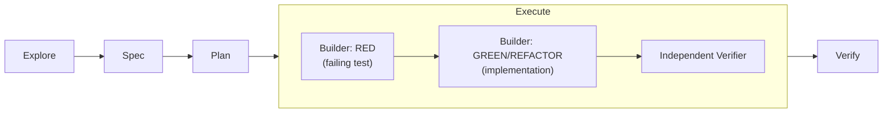

## Problem
The thing that goes wrong with AI-assisted development isn't broken code. It's that nobody can say why the code works or what it was ever checked against, including the person whose name is on the commit. Vibe coding leaves no trail: no spec to point at, no test that was red before it was green. Just "should be fine now."

## Method
Spec-Test-Driven Development runs every change through five stages: explore, spec, plan, execute, verify. Two mechanisms keep that trail auditable instead of decorative.

Spec-first means every requirement gets a stable REQ/S ID before any code exists, so a test can cite the exact requirement it proves. And the execute stage splits into RED then GREEN/REFACTOR, run by two separated agents: a builder that writes the failing test and then the implementation, and an independent verifier that re-checks the result against the spec IDs. Not against the builder's own summary, which is the part that matters. An agent grading its own homework will pass itself every time.

## Results
phosphorflux went from an empty repo to a published `v1.2.0` on npm in three days end to end. The suite sits at 461 tests across 101 files, all green, and the test code (11.4k LOC) outweighs the source it tests (8.8k LOC). Bilingual docs and CI are in place. Specs, plans and execution ledgers are published at [github.com/twjohnwu/phosphorflux/tree/main/docs/tlor-stdd](https://github.com/twjohnwu/phosphorflux/tree/main/docs/tlor-stdd), so the process claim can be checked rather than taken on trust.

## Limits
This is not a "three days from nothing" claim, and I'd rather say so than let the number do quiet work for me. The three days presuppose an orchestration framework and STDD skills that already existed going in. Building those took its own time, and that time isn't in the three days.

Token cost is the real price here. Running separated builder and verifier agents through five stages per change burns meaningfully more tokens than just writing the code. A token-reduction proposal sits in `docs/tlor-stdd/` in the same repo. It hasn't landed.

The repo has twelve git commits, which tells you almost nothing true about how this was built. What was explored, what was speced, what each execution round changed and why: that grain lives in the STDD artifacts, not the commit log. Which is exactly why those artifacts got published next to the code instead of rotting in a local `.claude/` directory.

## Sequel: the same pipeline, run again in Rust
Eleven days later I rewrote the same tool a second time, phosphorflux (TypeScript) into [phosphorpulse](https://github.com/twjohnwu/phosphorpulse) (Rust), through the same pipeline. Running it twice on one problem is what turned the process from an anecdote into something I could measure.

The costliest lesson from the first run was that the oracle arrived too late. The predecessor was executable the entire time, and I still spent several rounds eyeballing output before building a golden-diff comparison. The Rust run inverted the order, golden fixtures first, and the renderer needed zero walkthrough rounds: all 17 scenarios passed on first contact. The rule that fell out of it is blunt. Walkthrough rounds track oracle-less surface area. The TUI half of that same run, which has no oracle for visuals, keybindings or i18n, took nine.

The second run also moved the cost rather than removing it. Dropping the agent wrapper around the builder CLI cut a ~46k-token fixed floor per builder dispatch, which pushed the cost centre wholesale onto verification, around 81% of that run's spend. Every bottleneck you remove exposes the next one.

Requirement and scenario counts, fix rounds per stage, token accounting for both runs, and the four rework patterns they share: [tlor-orchestration `docs/en/stdd-reviews/statusline.md`](https://github.com/twjohnwu/tlor-orchestration/blob/main/docs/en/stdd-reviews/statusline.md).

phosphorflux is retired at `v1.2.0`. phosphorpulse `v0.1.0` supersedes it and ships a `migrate` command that carries the old configuration over.
