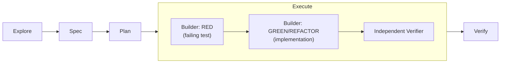

## Problem
The common failure mode of AI-assisted development isn't that the code doesn't work — it's that nobody, including the person who "wrote" it, can say why it works or what it was checked against. Vibe coding leaves no trail: no spec to point at, no test that was red before it was green, just a claim of "should be fine now."

## Method
Spec-Test-Driven Development (STDD) runs every change through five stages: **explore → spec → plan → execute → verify**. Two mechanisms make the trail auditable rather than decorative. First, spec-first: every requirement gets a stable REQ/S ID before any code exists, so a test can cite exactly which requirement it proves. Second, the execute stage itself splits into RED → GREEN/REFACTOR, run by two separated agents — a builder that writes the failing test and then the implementation, and an independent verifier that re-checks the result against the spec IDs rather than against the builder's own summary.

## Results
phosphorflux went from an empty repo to a published `v1.2.0` on npm. The suite sits at 461 tests across 101 files, all green, and the test code (11.4k LOC) outweighs the source it tests (8.8k LOC). Bilingual docs and CI are in place. Elapsed time end-to-end: three days. The full STDD trail — specs, plans, execution ledgers — is published at [github.com/twjohnwu/phosphorflux/tree/main/docs/tlor-stdd](https://github.com/twjohnwu/phosphorflux/tree/main/docs/tlor-stdd).

## Limits
This is not a "three days from nothing" claim and it shouldn't be read as one. The three days presuppose an orchestration framework and STDD skills that already existed going in — the time spent building that framework isn't in the three days, and pretending otherwise would misrepresent the number.

The token cost is the real price of this process, and it's worth saying plainly rather than glossing over: running separated builder/verifier agents through five stages per change burns meaningfully more tokens than writing the code directly. The mitigation direction — not yet landed — is a token-reduction proposal sitting inside `docs/tlor-stdd/` in the same repo.

The repo itself has only twelve git commits. The actual grain of the work — what was explored, what was speced, what each execution round changed and why — lives in the STDD artifacts (spec/tasks/ledger), not in commit history. That's exactly why those artifacts are published alongside the code instead of left in a local `.claude/` directory: the commit log alone would tell you almost nothing true about how this was built.

## Sequel: the same pipeline, run again in Rust
Eleven days later the same tool was rewritten a second time — phosphorflux (TypeScript) → [phosphorpulse](https://github.com/twjohnwu/phosphorpulse) (Rust) — through the same STDD pipeline. Running it twice on the same problem is what turned the process from anecdote into something measurable.

The costliest lesson from this first run was that the oracle arrived too late: the predecessor was executable the whole time, yet a golden-diff comparison was only built after several rounds of human eyeballing. The Rust run inverted that — golden fixtures first, implementation second — and its renderer needed zero walkthrough rounds: all 17 scenarios passed on first contact. The rule that fell out of it is blunt: walkthrough rounds track oracle-less surface area. The TUI half of the same run, which has no oracle for visuals, keybindings, or i18n, took nine.

The second run also relocated the cost. Dropping the agent wrapper around the builder CLI removed a ~46k-token fixed floor per builder dispatch, which pushed the cost centre wholesale onto verification — around 81% of that run's spend. Every bottleneck removed exposes the next one.

The full cross-run comparison — requirement and scenario counts, fix rounds per stage, token accounting for both runs, and the four rework patterns they share — is published at [tlor-orchestration `docs/en/stdd-reviews/statusline.md`](https://github.com/twjohnwu/tlor-orchestration/blob/main/docs/en/stdd-reviews/statusline.md).

phosphorflux is now retired at `v1.2.0`; phosphorpulse `v0.1.0` supersedes it and ships a `migrate` command that carries the old configuration over.
