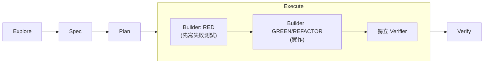

## 問題
AI 輔助開發真正出問題的地方不是 code 壞掉，而是沒有人講得出這段 code 為什麼會動、又是照什麼標準檢查過的——包括 commit 上掛著自己名字的那個人。Vibe coding 不留下任何軌跡：沒有 spec 可以指，沒有一支先紅過才變綠的測試，只有一句「應該可以了」。

## 方法
Spec-Test-Driven Development（STDD）把每次變更都跑過五個階段：explore → spec → plan → execute → verify。有兩個機制讓這條軌跡是真的可稽核，不是裝飾。

Spec 先行的意思是，任何 code 存在之前，每個需求都先拿到穩定的 REQ/S ID，讓測試可以明確指出自己在證明哪一條需求。而 execute 階段本身拆成 RED 再 GREEN/REFACTOR，由兩個分開的 agent 執行：builder 先寫會失敗的測試、再寫實作；獨立的 verifier 則對照 spec ID 重新檢查結果。重點在後半句——不是對照 builder 自己的結案報告。讓 agent 改自己的考卷，它每次都會讓自己過。

## 結果
phosphorflux 從空 repo 到在 npm 上發佈 `v1.2.0`，整段耗時三天。測試套件停在 461 個測試、101 個測試檔，全綠，而且測試程式碼（11.4k 行）比它測的 source（8.8k 行）還多。雙語文件與 CI 都已就位。spec、plan、執行 ledger 全部公開在 [github.com/twjohnwu/phosphorflux/tree/main/docs/tlor-stdd](https://github.com/twjohnwu/phosphorflux/tree/main/docs/tlor-stdd)，所以關於流程的主張是可以查的，不必信我一句話。

## 限制
這不是「三天無中生有」，我寧可先說清楚，也不想讓這個數字替我做暗示。三天的前提是 orchestration 框架與 STDD skill 都已經存在。建這套東西本身花掉的時間，不在這三天裡面。

Token 成本才是這裡真正的代價。讓分開的 builder 與 verifier 跑完每次變更的五個階段，比直接手寫 code 多燒不少 token。同一個 repo 的 `docs/tlor-stdd/` 裡放著一份 token 縮減提案，還沒落地。

這個 repo 只有十二個 git commit，而這件事幾乎講不出任何關於「它是怎麼被做出來的」的真相。探索了什麼、spec 了什麼、每一輪執行改了什麼又為什麼改，這種顆粒度在 STDD 的 artifacts 裡，不在 commit 歷史裡。這正是這些 artifacts 要跟 code 一起公開的原因，而不是留在本機的 `.claude/` 目錄裡慢慢腐爛。

## 續集：同一套流程，再用 Rust 跑一次
十一天後，我把同一個工具重寫了第二次：phosphorflux（TypeScript）→ [phosphorpulse](https://github.com/twjohnwu/phosphorpulse)（Rust），走同一套流程。在同一個問題上跑兩次，才讓這套流程從個案變成可以拿來量測的東西。

第一次最貴的教訓是判準（oracle）建得太晚。前代其實一路都是可執行的，我卻還是先花了好幾輪用肉眼看輸出，才做出黃金樣本比對。Rust 這次把順序倒過來，黃金樣本先寫，結果 renderer 的走查輪次是零：17 個情境第一次接觸就全過。掉出來的規則很直白：走查輪次多寡，反映的是「沒有判準可對的表面積」有多大。同一次執行裡的 TUI 部分，視覺、快捷鍵、i18n 都沒有判準可對，就走了九輪。

第二次也只是把成本搬了位置，沒有消掉。拿掉 builder CLI 外面那層 agent wrapper，等於移除每次 builder 派工約 46k token 的固定底盤，成本中心於是整個移到驗證，佔該次執行約 81%。每拆掉一個瓶頸，就會露出下一個。

需求與情境數、各階段的修復輪次、兩次的 token 帳，以及兩次共有的四個返工模式：[tlor-orchestration `docs/zh-TW/stdd-reviews/statusline.md`](https://github.com/twjohnwu/tlor-orchestration/blob/main/docs/zh-TW/stdd-reviews/statusline.md)。

phosphorflux 停在 `v1.2.0` 不再維護。phosphorpulse `v0.1.0` 接替它，並內建 `migrate` 指令把舊設定搬過去。
