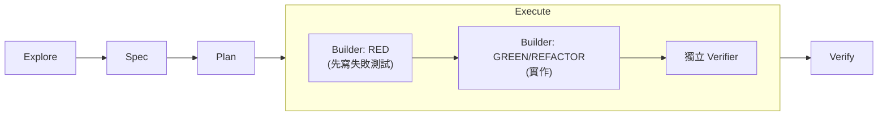

## 問題
AI 輔助開發最常見的失敗模式不是「code 跑不動」，而是連寫的人自己都說不出來為什麼跑得動、又是照什麼標準檢查過的。Vibe coding 不會留下任何軌跡：沒有 spec 可以對照，沒有先紅後綠的測試證據，只有一句「應該可以了」。

## 方法
Spec-Test-Driven Development（STDD）把每次變更都跑過五個階段：**explore → spec → plan → execute → verify**。有兩個機制讓這條軌跡是真的可稽核，不是裝飾。第一，spec-first：在任何 code 寫出來之前，每個需求都先拿到穩定的 REQ/S ID，讓測試可以明確指出自己在證明哪一條需求。第二，execute 階段本身拆成 RED → GREEN/REFACTOR，由兩個分開的 agent 執行——builder 負責先寫會失敗的測試、再寫實作；獨立的 verifier 則對照 spec ID 重新檢查結果，而不是聽 builder 自己的結案報告。

## 結果
phosphorflux 從空 repo 一路做到在 npm 上發佈 `v1.2.0`。測試套件累積到 461 個測試、101 個測試檔，全數綠燈，且測試程式碼（11.4k 行）比被測的 source（8.8k 行）還多。雙語文件與 CI 都已就位。整段從零到上架耗時三天。完整的 STDD 軌跡——spec、plan、執行 ledger——公開在 [github.com/twjohnwu/phosphorflux/tree/main/docs/tlor-stdd](https://github.com/twjohnwu/phosphorflux/tree/main/docs/tlor-stdd)。

## Limits
這不是「三天無中生有」的主張，也不該被這樣解讀。這三天的前提是 orchestration 框架與 STDD skill 都已經先存在——建這套框架本身花的時間並不算在三天裡,假裝沒這回事會誤導這個數字的意義。

Token 成本是這套流程真正的代價，值得老實講出來而不是輕描淡寫：讓分開的 builder/verifier agent 跑完五個階段，比直接手寫 code 要多燒不少 token。目前的緩解方向——還沒落地——是同一個 repo 裡 `docs/tlor-stdd/` 裡的 token 縮減提案。

repo 本身只有十二個 git commit。這份工作真正的顆粒度——探索了什麼、spec 了什麼、每一輪執行改了什麼、為什麼——並不在 commit 歷史裡,而是在 STDD 的 artifacts（spec/tasks/ledger）裡。這正是為什麼這些 artifacts 會跟著 code 一起公開,而不是留在本地的 `.claude/` 目錄裡:光看 commit log,幾乎看不出這東西是怎麼做出來的。

## 續集：同一套流程，再用 Rust 跑一次
十一天後，同一個工具被重寫了第二次——phosphorflux（TypeScript）→ [phosphorpulse](https://github.com/twjohnwu/phosphorpulse)（Rust），走的是同一套 STDD 流程。在同一個問題上跑兩次，才讓這套流程從個案變成可以量的東西。

第一次最貴的教訓是判準（oracle）建得太晚：前代其實一直是可執行的，但黃金樣本比對卻拖到人工肉眼檢查好幾輪之後才做出來。Rust 這次把順序倒過來——先寫黃金樣本（golden fixture），再寫實作——結果 renderer 走查輪次是零：17 個情境在使用者第一次接觸時就全過。從中掉出來的規則很直白：走查輪次的多寡，跟「沒有判準可對的表面積」成正比。同一次執行裡的 TUI 部分，視覺、快捷鍵、i18n 都沒有判準可對，就走了九輪。

第二次也讓成本換了位置。拿掉 builder CLI 外面那層 agent wrapper，等於移除每次 builder 派工約 46k token 的固定底盤，成本中心整個移到驗證——約佔該次執行的 81%。每拆掉一個瓶頸，就會露出下一個。

完整的跨次比較——需求與情境數、各階段修復輪次、兩次的 token 帳，以及兩次共有的四個返工模式——公開在 [tlor-orchestration `docs/zh-TW/stdd-reviews/statusline.md`](https://github.com/twjohnwu/tlor-orchestration/blob/main/docs/zh-TW/stdd-reviews/statusline.md)。

phosphorflux 已停在 `v1.2.0` 並停止維護；phosphorpulse `v0.1.0` 接替它，並內建 `migrate` 指令把舊設定搬過去。
