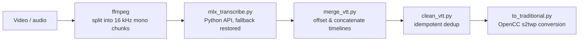

## Problem
Meeting recordings and internal training videos are sensitive content that shouldn't be uploaded to cloud ASR services. The local `mlx_whisper` CLI handles short clips fine, but on long audio it derails at silences and slide-transition pauses — the same phrase repeated for hundreds of lines, single characters stuttering into garbage, and "YouTube outro" sign-offs hallucinated from the training corpus during trailing silence.

## Root Cause
Reading the upstream `mlx_whisper/transcribe.py` source revealed the cause: Whisper ships with a temperature fallback tuple `(0.0, 0.2, …, 1.0)` — when a segment is too repetitive (compression ratio over threshold), it re-decodes at a higher temperature. **But the CLI hard-codes `--temperature` as a single float**, collapsing the tuple to `[0.0]` and disabling the fallback entirely, with no CLI flag able to pass a tuple back. Loops never get retried.

## Architecture

## My Role
Designed and built the entire pipeline independently (`extract_transcript.py` is a vendored third-party component, MIT-attributed).

## Impact
- Three defense layers: the Python API path restores the temperature fallback, chunked transcription confines any loop to its own chunk, and a final dedup pass removes residual stutter and hallucinated boilerplate
- Resumable batch runs: files with existing output are skipped, all writes are atomic — interrupt and rerun to continue
- Audio never leaves the machine; ASR runs on the Mac's GPU (Metal/MLX). Also installable as a Claude Code skill — "transcribe this video" triggers it

## Lessons — the real fix lives in the upstream source
The symptom (repetition loops) looks like a model problem; swapping models or tuning prompts is guesswork. Reading one layer down into the CLI wrapper revealed a single hard-coded line that switched off the built-in safeguard — root-cause analysis starts from the tool's source code, not its documentation.
