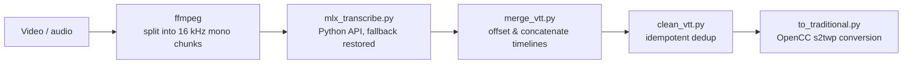

## Problem
Meeting recordings and internal training videos are exactly the material you don't hand to a cloud ASR service. The local `mlx_whisper` CLI is fine on short clips. On long audio it derails at silences and slide-transition pauses: the same phrase repeated for hundreds of lines, single characters stuttering into garbage, and, during the trailing silence, a cheerful YouTube-style sign-off hallucinated straight out of the training corpus.

## Root cause
The answer was in the upstream `mlx_whisper/transcribe.py`. Whisper ships a temperature fallback tuple, `(0.0, 0.2, …, 1.0)`: when a segment comes back too repetitive (compression ratio over threshold), it re-decodes at a higher temperature. The CLI hard-codes `--temperature` as a single float, which collapses that tuple to `[0.0]` and switches the fallback off entirely. No CLI flag can pass a tuple back in. So the loops are never retried, and the safeguard that was designed for exactly this failure never runs.

## Architecture

## My role
I designed and built the pipeline on my own. `extract_transcript.py` is a vendored third-party component, MIT-attributed.

## Impact
- Three layers of defense, because I don't trust any one of them alone: the Python API path restores the temperature fallback, chunked transcription keeps a loop trapped inside its own chunk, and a final dedup pass clears residual stutter and hallucinated boilerplate
- Batch runs are resumable. Files with existing output get skipped and every write is atomic, so you can interrupt a run and pick it back up
- Audio never leaves the machine; ASR runs on the Mac's GPU through Metal/MLX. It also installs as a Claude Code skill, so "transcribe this video" is enough to start it

## Lessons — the real fix was one layer down
Repetition loops look like a model problem, and treating them as one means swapping models and tweaking prompts, which is guesswork with a cost per attempt. One layer down, in the CLI wrapper, sat a single hard-coded line that had turned off a built-in safeguard. Root-cause analysis starts in the tool's source, not its documentation.
