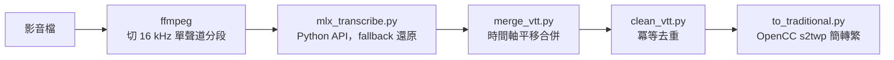

## 問題
會議錄音和內部教育訓練影片，正好是那種你不會交給雲端 ASR 服務的素材。本機的 `mlx_whisper` CLI 跑短片沒問題，長音檔卻會在靜音和換頁停頓的地方脫軌：同一句話重複幾百行、單字連打成亂碼，收尾那段靜音裡還會冒出一句訓練語料帶來的、YouTube 式的歡快結尾致詞。

## 根因
答案在上游的 `mlx_whisper/transcribe.py` 裡。Whisper 本身帶了一組 temperature fallback tuple `(0.0, 0.2, …, 1.0)`：偵測到某段回來的結果過度重複（compression ratio 超標），就升溫重解一次。但 CLI 把 `--temperature` 硬編碼成單一 float，這個 tuple 就塌縮成 `[0.0]`，fallback 整個被關掉，而且沒有任何 CLI 參數能把 tuple 傳回去。於是跳針永遠不會被重試，那個原本就是為這種失敗設計的防護，一次也沒跑過。

## 架構

## 我的角色
整條 pipeline 由我獨力設計與實作。其中 `extract_transcript.py` 是 vendored 的第三方元件，依 MIT 授權標註。

## 成果
- 三層防線，因為我不信任其中任何單獨一層：改走 Python API 還原 temperature fallback、分段轉錄把跳針關在自己的 chunk 裡、最後一輪去重清掉殘餘的連打與幻覺套語
- 批次可續跑：已經有輸出的檔案自動跳過，每次寫檔都是原子操作，跑到一半中斷、回來接著跑就好
- 音訊全程不離開這台機器，ASR 在 Mac 的 GPU 上透過 Metal/MLX 完成；它也能裝成 Claude Code skill，說一句「幫我轉逐字稿」就會動起來

## 學到什麼——真正的修法在下面一層
跳針看起來像模型的問題，而當成模型問題處理，就會變成換模型、調 prompt，那是每試一次都要付費的猜謎。往下一層，在 CLI 的封裝裡，躺著一行硬編碼，把原廠內建的防護整個關掉了。根因分析的起點是工具的原始碼，不是工具的文件。
