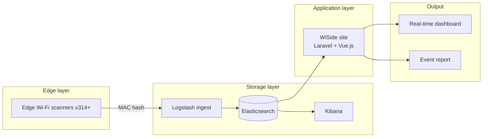

## Problem
Cities running large outdoor events needed real-time, privacy-friendly crowd estimates. Traditional CCTV counting is expensive and slow to deploy. We had to count people at scale without collecting personal data.

## Architecture

## My Role
Owned the Laravel + Vue.js management backend and the real-time dashboard / event-report output layer. Worked with the edge-hardware and ELK pipeline teams to pin the query contract up front so hardware iterations didn't cascade into backend rewrites; designed the data view model for multiple events running in parallel.

## Impact
- Taipei City NYE 2020 — 15 scanners, 113,000 attendees detected
- 2019 political rally — 20 scanners, 55,000 attendees detected
- 314+ scanners deployed by Sep 2021
- Featured at 22+ industry exhibitions

## Lessons
I owned WiSide's application layer (Laravel + Vue.js admin) and output layer (real-time dashboard + event reports) solo; edge scanners and the ELK pipeline were team work. Working at the boundary between layers — without control over either side — forced a discipline I've kept since: define the interface contracts first, and let both sides evolve against the contract rather than against each other. Scanner protocol and ELK query schema were versioned independently; when the ELK team later upgraded the server, the changes were absorbed at the interface layer without touching application logic. Owning two layers alone, without owning the layers above or below, is where I learned to design for change rather than design for now.
