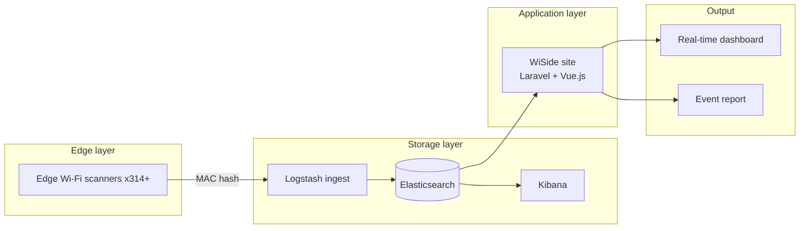

## Problem
Cities running large outdoor events want a crowd number they can act on while the event is still happening. CCTV counting is expensive and slow to deploy, and it collects far more than a headcount. Our constraint was to count people at scale while collecting nothing personal about any of them.

## Architecture

## My role
I owned the Laravel + Vue.js management backend and the output layer: the real-time dashboard and the event reports. The hardware team and the ELK pipeline team sat on either side of me, and the first thing I pushed for was pinning the query contract before either side started iterating. Hardware iterations are constant on a product like this, and without that contract every one of them would have turned into a backend rewrite. I also designed the data view model for multiple events running at the same time, which is the case that breaks naive dashboards.

## Impact
- Taipei City NYE 2020: 15 scanners, 113,000 attendees detected
- A 2019 political rally: 20 scanners, 55,000 attendees detected
- 314+ scanners deployed by Sep 2021
- Featured at 22+ industry exhibitions

## Lessons
I ran WiSide's application layer and output layer solo. The edge scanners and the ELK pipeline were other people's work, which meant I lived at the boundary between layers I didn't control on either side. That taught me something I've kept: define the interface contracts first, then let both sides evolve against the contract instead of against each other.

The scanner protocol and the ELK query schema were versioned independently. When the ELK team later upgraded the server, the change got absorbed at the interface layer and the application logic never moved. I'd been designing for now until that project; owning two layers without owning the ones above or below is where I started designing for change.
