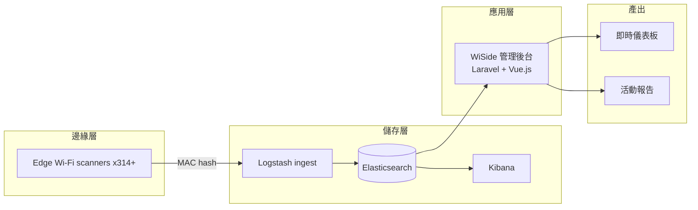

## Problem
都市活動需要即時、隱私友善的人流估算。傳統 CCTV 計數成本高、布設慢。我們要在不蒐集個資的前提下，於戶外大型活動快速布設、即時回傳人潮。

## Architecture

## My Role
獨立負責 Laravel + Vue.js 管理後台與即時儀表板 / 活動報告產出層；與硬體和 ELK pipeline 團隊定義查詢介面，設計多活動並行的資料檢視模型。

## Impact
- 2020 台北跨年 15 scanners 偵測 113,000 人次
- 2019 政治造勢 20 scanners 偵測 55,000 人次
- 2021-09 累積部署 300+ scanners
- 22+ 業界展覽

## Lessons
我獨立負責應用層（Laravel + Vue.js 管理後台）與產出層（即時儀表板、活動報告）；scanner 由硬體團隊負責、ELK pipeline 由資料團隊負責。卡在兩層的介面之間、上下都不歸我管，逼出一個我延續至今的工作習慣：先把介面契約寫死，讓雙方各自演進，而不是互相牽制。Scanner 協定與 ELK 查詢 schema 獨立版控；後來 ELK 團隊升級 server，所有變更都被吸收在介面層，應用邏輯一行沒動。獨擔兩層、上下都不在自己手上，就是我學會「為變化設計，不為現在設計」的地方。
