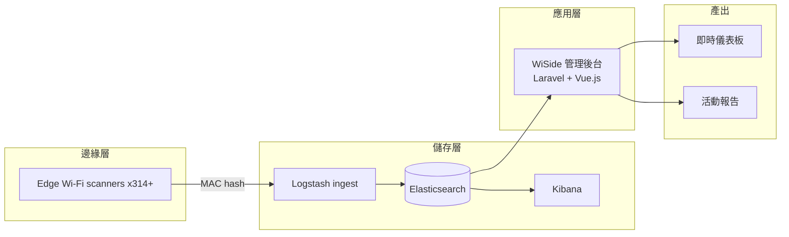

## 問題
辦大型戶外活動的城市，要的是活動還在進行時就能拿來做決定的人流數字。CCTV 計數成本高、布設慢，而且蒐到的東西遠遠超過一個人數。我們的限制條件是：要能大規模數人，同時不蒐集任何一個人的個資。

## 架構

## 我的角色
我負責 Laravel + Vue.js 的管理後台，以及產出層：即時儀表板和活動報告。硬體團隊和 ELK pipeline 團隊分別坐在我的兩邊，而我第一件力推的事，是在兩邊開始各自迭代之前先把查詢契約釘死。這種產品的硬體是一直在改的，沒有那份契約，每一次硬體迭代都會變成一次後端重寫。多個活動同時進行時的資料檢視模型也是我設計的——那正是隨手做的儀表板會壞掉的那種情況。

## 成果
- 2020 台北跨年：15 台 scanner，偵測 113,000 人次
- 2019 一場政治造勢：20 台 scanner，偵測 55,000 人次
- 到 2021-09 累積部署 314+ 台 scanner
- 在 22+ 場業界展覽展出

## 學到什麼
WiSide 的應用層與產出層是我一個人扛的。邊緣的 scanner 和 ELK pipeline 是別人的工作，也就是說，我住在兩層之間的介面上，而上下兩邊都不歸我管。這件事留給我一個延續至今的習慣：先把介面契約定下來，然後讓兩邊各自對著契約演進，而不是互相牽制。

Scanner 協定和 ELK 查詢 schema 是獨立版控的。後來 ELK 團隊升級 server，變更全部被吸收在介面層，應用邏輯一行沒動。在那個專案之前，我都是為現在設計；獨擔兩層、上下都不在自己手上，是我開始為變化設計的地方。
